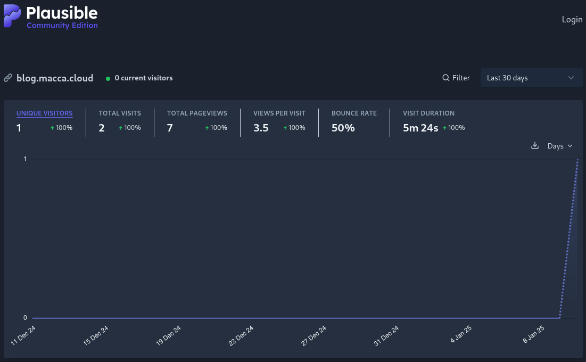

+++
title = "Hello Plausible"
date = "2025-01-10"
description = "A cookieless, GDPR-compliant, self hostable user tracking platform"
[taxonomies]
topic = ["privacy", "selfhosting"] 
+++
TL;DR: I enabled [Plausible](https://plausible.io) analytics on my blog.
Don't worry! This doesn't mean I'm scanning and profiling your personal data: Plausible is a cookieless,
fully GDPR-compliant analytics platform (that I'm currently [selfhosting](https://plausible.macca.cloud/blog.macca.cloud))
meant to be used as a replacement for Google Analytics. I don't even need a cookie banner!
 
 

### Simple stuff

 

As soon as I started writing on this blog I figured: _"wow, now that I setup everything I won't even know how many people will actually read my posts"_; my **blogging career** was already being threatened by uncertainty and doubt. 
_"Fear nothing!"_, shouted my mind when suddenly I realized that I setup Plausible for a client in 2023. Well, that was quick, wasn't it? 
Quick and painless indeed it was, because setting up Plausible is a **breeze**, it's just a matter of environmental variables and an effortless `podman compose up` and everything comes up real smooth.
 
A **huge** plus is that Plausible is _really_ simple to use and understand: I even setup Google Search Console tracking, everything straight from the docs. It even comes with a [live visitor count page](https://plausible.macca.cloud/blog.macca.cloud)!

 
Well, that was all. I just wanted to inform you!
 
 
Until the next post!
