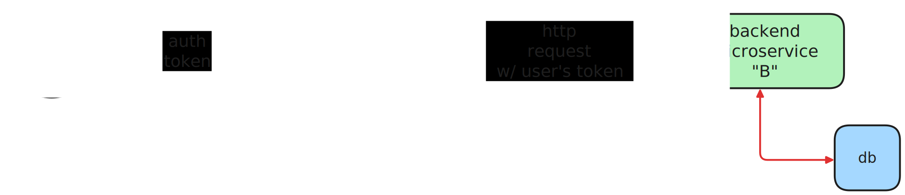
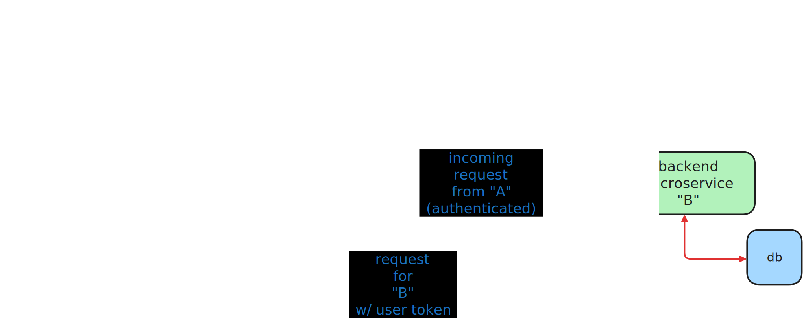

+++
title = "JWT authentication on NGINX with JWK"
date = "2025-01-25"
description = "Decentralized authentication has never been so easy"
[taxonomies]
topic = ["microservices", "authentication", "nginx"]
+++

In the world of microservices we often come across _cross cutting concerns_ which can be summarized in, essentially, code that needs to be implemented in multiple layers, such as _logging_, _security stuff_, <strong>_authentication and authorization_</strong>, etc...
<br>
Cross cutting concerns can lead to duplicated code, difficult maintenance and general uneasiness in our system.
Today, we will address the problem of de-duplicating authorization logic from our microservices using NGINX, one of my favourite piece of software EVER.
<br><br>

## The problem

<br>

Let's say we have multiple cooperating microservices in our system, each handling the business logic of our product.<br>
The textbook interaction between two microservices is the HTTP request, which will contain the authorization token given to the user that is issuing such request.
<br>


This pattern is extremely common and is, essentially, at the basis of microservice communication, but a silent enemy is ready to strike a shot at us: the authorization logic.
With this setup, we will have to implement authorization logic for each microservice in our system, duplicating code and reducing mainteinability; the problem gets much worse if we have different programming languages in our system!
<br>
<br>

## The solution

<br>

To solve this dauting dilemma, we can leverage the [application gateway pattern](https://microservices.io/patterns/apigateway.html) and place authentication logic at its level: every request will then pass through the application gateway
layer before reaching the corresponding microservices, and authentication policies will be implemented just once (on the application gateway itself!).
<br>

<br>
This way, the application gateway will act as a centralized request router and we will be able to remove the duplicated authorization logic on our microservices.
Naturally, we will have to replicate the application gateway to ensure high availability in production scenarios.
<br><br>

## Implementation with NGINX + NJS and Keycloak

<br>

Note: what we will see today is a proof-of-concept scenario that is definitely not ready for production: the aim of this article is to give you a general idea on which you can build more complex scenarios.
<br>
I love NGINX because it never stopped evolving through the years, constantly keeping its game up even against tough competition (see Caddy or Traefik).<br>
One thing that drastically eased the modularity of NGINX was the introduction of [NJS](https://nginx.org/en/docs/njs/), essentially a JS runtime inside NGINX (I know it sounds daunting at first, but bear with me for a second),
that completely revolutionized how custom functionality can be added to a standard NGINX installation.
<br>
Today, we will see how to implement a _proof of concept_ JWT authentication mechanism using [JWKS](https://auth0.com/docs/secure/tokens/json-web-tokens/json-web-key-sets), aka public keys for JWTs.
<br>
If you're not familiar on how JWT authentication works, you can [read the official introduction](https://jwt.io/introduction), but basically, all you need to know
is that JWTs are non-opaque tokens (meaning that can encode information) that are signed from somebody with a key (that can be asymmetric or symmetric); such signature can be then verified from
others using the corresponding verification mechanism (which is HMAC verification for symmetric keys or public key verification for asymmetric keys).
<br>
<br>

#### A simple `compose.yaml` file

<br>

We will model an example scenario using Docker Compose for simplicity, but the following can be replicated in whatever environment you want, of course.
Our `compose.yaml` file will look like this:

```yaml
networks: 
  nginx-jwk-net:

services:
  microservice-a:
    build: 
      dockerfile: Dockerfile
      context: ./microservice-a
    networks:
      - nginx-jwk-net

  microservice-b:
    build: 
        dockerfile: Dockerfile
        context: ./microservice-b
      networks:
        - nginx-jwk-net
  
  kc:
    build:
      dockerfile: ./keycloak/Dockerfile
    ports:
      - 8080:8080
    entrypoint: ["/opt/keycloak/bin/kc.sh", "start-dev"]
    environment:
      - KC_HOSTNAME=localhost
      - KC_HOSTNAME_PORT=8080
      - KC_HOSTNAME_STRICT=false
      - KC_HOSTNAME_STRICT_HTTPS=false
      - KEYCLOAK_ADMIN=admin
      - KEYCLOAK_ADMIN_PASSWORD=admin
    networks:
      - nginx-jwk-net
  
  nginx:
    depends_on:
      - kc
      - microservice-a
      - microservice-b
    build:
      network: host
      context: ./nginx
    volumes:
      - ./nginx/etc/nginx.conf:/etc/nginx/nginx.conf
      - ./nginx/etc/conf.d:/etc/nginx/conf.d
      - ./nginx/etc/js:/etc/nginx/js
    networks:
      - nginx-jwk-net
    ports:
      - 58080:6000
```
