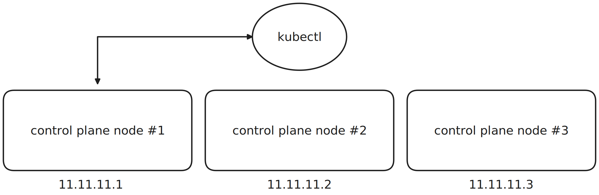
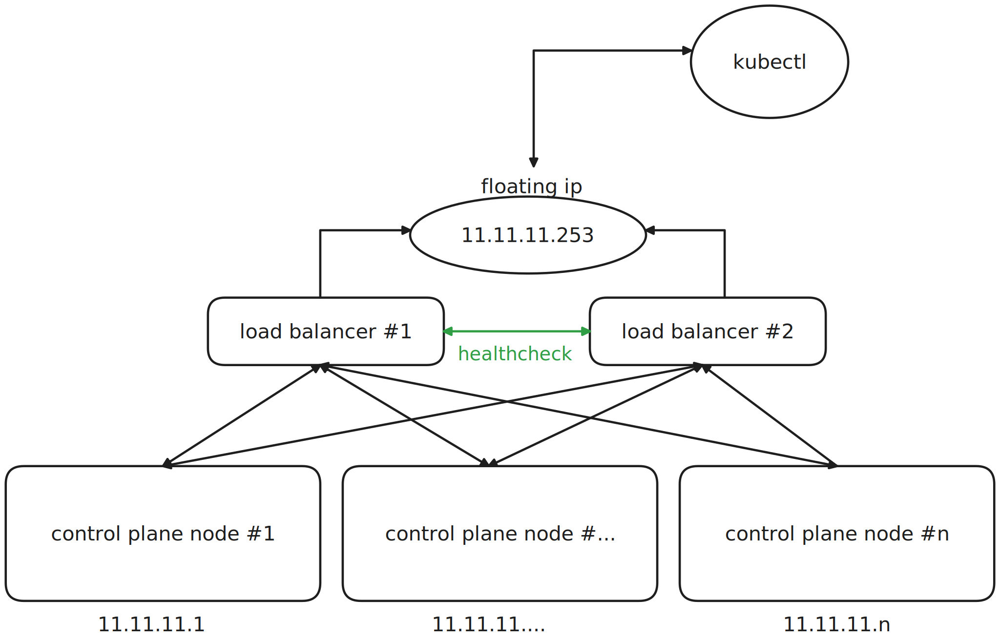

+++
title = "Load balancing the Kubernetes Control Plane"
date = "2025-01-16"
description = "Highly available control plane components for the simple folk"
[taxonomies]
topic = ["kubernetes", "networking", "homelab"]
+++

When creating a Kubernetes cluster, one of the first things the documentation recommends is [load balancing the control plane](https://kubernetes.io/docs/setup/production-environment/tools/kubeadm/create-cluster-kubeadm/#initializing-your-control-plane-node).
<br>
Since the official guide doesn't cover methods to do so, let's find out a simple yet very effective method that anyone can implement in their own network without having special hardware.
<br>
<br>

## Optional ramble: true load balancing and other psyops

<br>

This is an optional (yet informative) paragraph about the nuances of load balancing, if you're here just for the practical part or you already know what I'm talking about,
feel free to [skip to the next paragraph](#actual-stuff).
<br>
There are two types of load balancing:

- passive/active load balancing
- active/active load balancing

<br>

The first one, which is the topology we are going to implement, is _not_, unfortunately, what you can call "true" load balancing, because in such
scenario, only _one_ -- the **active** one -- of the available load balancers are actually routing traffic at a certain point in time, whereas the others are in standby, waiting for the
active load balancer to fail. Once such failure happens, one of the "waiting"  load balancers -- the **passive** ones -- will be elected as the main one.
<br>
We will enter into detail about how all of this works in a bit.
<br><br>
When talking about an **active/active** scenario, multiple load balancers work _in parallel_ to achieve **true** load balancing, meaning that traffic
can be routed by many load balancers at the same time.
This is generally achieved through what is called a **anycast** setup, generally obtained using [BGP](https://it.wikipedia.org/wiki/Border_Gateway_Protocol).
In this scenario, there are no single points of failure, because if some load balancer fails, there is no actual downtime.
<br>
BGP is very clever, because, in very simple terms (but it's essentially all it does), it "enables multiple hosts to **share the same IP**" (it's an oversimplification, but you get the point) and advertise it from different locations at the same time: it's essentially the protocol that
makes the modern internet work. Have you ever wondered how CDNs can serve traffic from multiple locations all over the world? Well, that's essentially BGP!<br>
Take a look at it yourself and try to `dig google.com`:

```bash
$ dig google.com
; <<>> DiG 9.18.30 <<>> google.com
;; global options: +cmd
;; Got answer:
;; ->>HEADER<<- opcode: QUERY, status: NOERROR, id: 46619
;; flags: qr rd ra; QUERY: 1, ANSWER: 1, AUTHORITY: 0, ADDITIONAL: 1

;; OPT PSEUDOSECTION:
; EDNS: version: 0, flags:; udp: 65494
;; QUESTION SECTION:
;google.com.   IN A

;; ANSWER SECTION:
google.com.  93 IN A 142.250.180.174 <-- THIS LINE HERE!

;; Query time: 21 msec
;; SERVER: 127.0.0.53#53(127.0.0.53) (UDP)
;; WHEN: Thu Jan 16 15:43:39 CET 2025
;; MSG SIZE  rcvd: 55
```

How can Google have just _one_ IP for the whole traffic it handles? Shouldn't they have more than one? No! That's because that is an _anycast_ IP, meaning that
it gets advertised from many places all over the world and BGP-enabled routers can correctly route traffic to the nearest "advertising point", reducing latency and optimizing resources.
<br>
The same concept can be applied in your network or, much more realistically, inside a datacenter, where there are multiple routers and multiple load balancers doing **STUFF** no one knows about, using various software and/or special routers, but we are not here for that (I'll probably make a post in the future about BGP tho).<br>
If you're intrested, there's a [very good Cloudflare blog post](https://blog.cloudflare.com/cloudflares-architecture-eliminating-single-p/) about the matter.
<br><br>

## <a name="actual-stuff"></a> `keepalived` and NGINX to the rescue

<br>

Let's go back to our homelab, where we don't have BGP-enabled routers because we don't want to, because we are simple people and because we just want our damn Kubernetes cluster, on which we definitely spent too much time, to be reacheable if one
control plane node goes down.
<br><br>
Before proceeding, what would happen if we didn't load balance our control plane?
<br>
Let's imagine we had three control plane components and we had our `~/.kube/config` file configured as such:

```yaml
# example kubeconfig file 
apiVersion: v1
clusters:
- cluster:
    certificate-authority-data: ...
    server: https://11.11.11.1:6443
  name: homelab
# ... more stuff 
```

That would correspond to this scenario:



<br>

If that node went down, the cluster wouldn't be reacheable anymore, and we would have to manually change the endpoint in our `~/.kube/config` file!

<br>
<br>

What we want to achieve is the following setup:


We essentially want clients to be able to reach our control plane components (i.e. the `kube-apiserver` on which all `kubectl` commands are sent to)
using only one IP (in this case `11.11.11.253`) that will automatically represent **all** control plane nodes.
<br>
The connections will be load balanced using **two** NGINX instances which will share such IP (using `keepalived`): this way we won't have any single point of failure (just a little downtime if one of the load balancers goes offline, but that's because of our active/passive setup)
on our load balancers: having only **one** could be a problem for our Kubernetes cluster if the load balancer were to go offline.
<br><br>
<hr>
<br><br>

Even if it doesn't seem so, achieving this infrastructure is actually quite simple and painless: we will setup NGINX to forward connections to our control plane and `keepalived` for the active/passive setup.
<br>
<br>

### The configuration

<br>

In this scenario we have two load balancers so, naturally, this setup has to be done twice.
<br>
You can install NGINX and `keepalived` following the official guides: [NGINX](https://docs.nginx.com/nginx/admin-guide/installing-nginx/installing-nginx-open-source/), [Keepalived](https://keepalived.readthedocs.io/en/latest/installing_keepalived.html).
<br>
Pick the load balancer you want to be the **main** one and create a `keepalived.conf` file inside `/etc/keepalived` with the following content:

```
! main configuration (this is a comment)
global_defs {
   ! name of the load balancer, doesn't really matter what you choose
   router_id nginx_lb
}

vrrp_script check_nginx {
    ! the script that will be used to check if the nginx process
    ! on this machine is still alive
    script "/bin/check_nginx.sh"
    interval 2
    weight 50
}

vrrp_instance VI_1 {
    ! MASTER (ugh) = main node
    state MASTER
    ! which interface should keepalived listen on
    interface eth0
    ! whatever number you want, it has be the same
    ! for each "pool" of load balancers that you want to share the same IP 
    ! on
    virtual_router_id 51
    ! the main node should have higher priority than secondary ones
    priority 110
    ! advertisement interval in seconds
    advert_int 1
    ! the ip you want to listen for
    virtual_ipaddress {
     11.11.11.253/24
    }
    track_script {
      ! the script we defined earlier
      check_nginx
    }
}

```

More details on configuration parameters [here](https://keepalived.readthedocs.io/en/latest/configuration_synopsis.html).
<br>
The `/bin/check_nginx.sh` should look like this:

```bash

#!/bin/sh
if [ -z "`/bin/pidof nginx`" ]; then
 systemctl stop keepalived.service
 exit 1
fi
```

This means: _"if /bin/pidof nginx (nginx's process id) is null then shutdown keepalived"_
<br>
On the **secondary** load balancer you'll write the same configuration we just saw but with the `state` variable changed to `BACKUP`:

```
global_defs {
  ...
}
vrrp_script ...
vrrp_instance VI_1 {
  state BACKUP
  ...
}
```

Keeaplived will automatically keep track of all the load balancers that share the same `virtual_router_id` using the
[VRRP protocol](https://en.wikipedia.org/wiki/Virtual_Router_Redundancy_Protocol).
<br>
With this configuration, the active load balancer will reply to **ARP queries** issued to `11.11.11.253` just as if it was its primary IP address.
Backup nodes will do the same when the main load balancer goes offline. Looks difficult, but it's a really simple concept (and protocol)!
<br><br>
To actually load balance connections issued to the control plane we will use the following NGINX configuration (`/etc/nginx/conf.d/loadbalance.stream`):

```nginx
stream{
  upstream k8s {
          least_conn;
          server 11.11.11.1:6443 max_fails=3 fail_timeout=5;
          server 11.11.11.2:6443 max_fails=3 fail_timeout=5;
          # add as many servers as you need
          # server 11.11.11....:6443 max_fails=3 fail_timeout=5;
 }
  upstream etcd {
          least_conn;
          server 11.11.11.1:6001 max_fails=3 fail_timeout=5;
          server 11.11.11.2:6443 max_fails=3 fail_timeout=5;
          # add as many servers as you need
          # server 11.11.11....:6443 max_fails=3 fail_timeout=5;
  }
  server { 
          listen 4001;
          proxy_pass etcd;
  }
  server { 
          listen 6443;
          proxy_pass k8s;
  }
}
```

#### IMPORTANT: the `stream` module must be enabled on NGINX for this to work

<br>

With this configuration NGINX will load balance connections between all the Kubernetes control plane components.
<br>
Note that this setup is not something limited to Kubernetes: you can use this configuration to load balance traffic to your websites or whatever service you have replicated on multiple servers!
<br>

## Final touch: `~/.kube/config`

<br>

You'll need to edit your `~/.kube/config` file with the floating IP we defined inside Keepalived's configuration:

```yaml
apiVersion: v1
clusters:
- cluster:
    certificate-authority-data: ...
    server: https://11.11.11.253:6443 # yay!
  name: homelab
```

You can now try to disable one load balancer and issue a `kubectl` command: if you followed the guide correctly, everything should still be working!
<br><br>
That was all for today, thank you for sticking with me until the end.
<br>
Until the next post!
