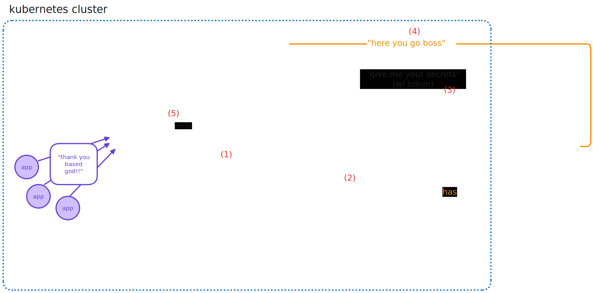
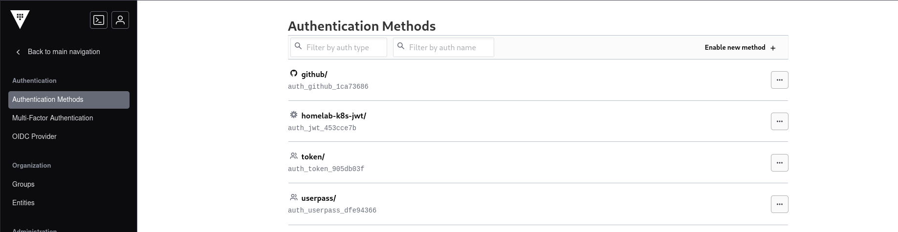

+++
title = "Storing Kubernetes secrets safely with Vault and External Secrets Operator"
date = "2025-02-10"
description = "Store, retrieve and sync Kubernetes secrets in a safe way"
[taxonomies]
topic = ["kubernetes", "security"] 
+++

When running a Kubernetes cluster, secrets are generally stored in an unsafe way inside [etcd](http://etcd.io) by default. Although you can configure [encryption at rest](https://kubernetes.io/docs/tasks/administer-cluster/encrypt-data/), the implementation of such mechanisms can be cumbersome and difficult to maintain, especially because it requires you to do all the heavy lifting (you'll need to handle keys and their storage, secret rotation...).
<br>

Vault directly addresses the problem by offering an _encryption-as-a-service_ platform on which we can securely provision and store secrets. That's not all Vault does, though: it also offers a fine-grained permission system with which we can control how applications can access secrets. This way, accountability can be implemented inside our cluster and secret and/or permission revocation (in case of leaks) can be tempestively applied.
<br>
<br>

Note: in this post I will assume you already have a Vault instance/cluster running and that you know your way around it. If that's not the case, I strongly suggest reading the [get started guide](https://developer.hashicorp.com/vault/tutorials/get-started).

<br>

## The need for this post

<br>

I decided to write this post not only because I find the matter particularly interesting, but because the [official documentation](https://developer.hashicorp.com/vault/tutorials/kubernetes/vault-secrets-operator) is somewhat half-baked and incoherent about the matter, because it relies on HashiCorp's own secrets operator to work (that is not, in my opinion, sufficiently documented), probably because Vault's focus, as a product, is towards enterprise-grade software. Well, I have a homelab to run, and I don't care about what I can and I cannot do, I want my homelab to be as fancy as possible! I want secrets synced from Vault to my cluster even if I'm not going to run ANYTHING on it!
<br>
<br>
Luckily, the CNCF is supporting [External Secrets Operator](https://external-secrets.io/latest/) (ESO), an open-source secret management platform that can sync secrets from [many different providers](https://external-secrets.io/latest/provider/hashicorp-vault/), including Vault clusters! Fantastic!

<br>

## JWT authentication

<br>

Vault architecture provides an authentication layer clients (i.e. a Kubernetes cluster) can use to access secrets. In this tutorial, we are going to use Vault's JWT authentication.
<br>

Vault will be able to authenticate requests coming from our Kubernetes cluster because it will use the cluster's public key to verify JWTs. To explain a bit better the context, let's refer to the image below:


1. the ESO, running inside the Kubernetes cluster, is associated with a [Kubernetes Service Account](https://kubernetes.io/docs/concepts/security/service-accounts/). It can request tokens that can be used to issue authenticated requests to other services;
2. since Service Accounts generate tokens using the cluster's certificate, a new token is issued to the operator, with a given expiration time (a new request will be issued once the token is not valid anymore).
3. now that the ESO has a token, it can issue requests for secrets to Vault. Since Vault knows the Kubernetes cluster's public key it can verify the JWT the ESO is using to request secrets;
4. given the permissions on the requested secrets (we will see this in a bit), Vault emits the secret back to the ESO. Note: the communication between the ESO and Vault is done via HTTPS (your Vault instance is running on HTTPS, right???);
5. now that everything is connected, the ESO can create a `Secret` inside the Kubernetes cluster that apps can consume correctly!

<br>

## Configuring Vault

<br>

The first thing we are going to do is obtaining our cluster's public key which Vault will then use to verify ESO's tokens. To do so, log onto a Kubernetes Control Plane node and navigate to the `/etc/kubernetes/pki` directory; there you'll find the `sa.pub` file, which is the public key associated to the private key (`sa.key`). Copy that file somewhere you can access with the `vault cli`.

<br>

Once you got your public key file, we need to enable the JWT authentication method on Vault by typing this command:

```bash
vault auth enable jwt
```

This enables the JWT authentication method system-wide.

<br>

Next, let's create a new Vault [**policy**](https://developer.hashicorp.com/vault/docs/concepts/policies), which we will then link to a Vault [**role**](https://developer.hashicorp.com/vault/tutorials/get-started/introduction-roles) for permissions purposes.

<br>

Policies are written in the `hcl` format, we can write a file containing something along these lines:

```hcl
path "path/to/secret" {
  capabilities = ["read", "list"]
}
```

If you store your secrets, for example, inside the `kv-v2` namespace, you'll write something like this:

```hcl
# k8s-jwt-policy.hcl 
path "kv-v2/data/kubernetes/supersecret" {
  capabilities = ["read", "list"]
}
```

We can write our policy with:

```bash
vault policy write k8s-policy path/to/policy.hcl
```

This way, we created a policy called `k8s-policy` that, when attached to a role, will give consumers the ability to access (because of the `read` and `list` permissions) vaules stored in the `kv-v2/data/kubernetes/supersecret` secret.
<br><br>

Now, we can configure an authentication backend. As far as I know you can only add new authentication methods from the Vault UI.
<br>
Go to Access (on the sidebar) >  Enable new method (+)



Select "JWT", choose whatever name you want and click on "Enable method". For the sake of this post, we will use `jwt-auth` as the authentication method's name.

<br>

Now, we can bind the `sa.pub` we downloaded before to the `jwt-auth` method:

```bash
vault write auth/jwt-auth/config \
  jwt_validation_pubkeys=@path/to/sa.pub
```

Now that we configured the key, let's add a **role** called `secret-accessor`:

```bash
vault write auth/jwt-auth/role/secret-accessor \
  token_policies=k8s-policy \
  user_claim=sub \
  role_type=jwt \
  bound_audiences=vault 
```

This way, Vault will verify incoming JWTs checking the `sub` claim for a non-null value and the `audience` value for the `vault` string, since JWT tokens have the following structure:

```json
{
  "iss": "kubernetes/auth",
  "sub": "system:serviceaccount:default:my-sa",
  "aud": "vault",
  "exp": 1696776000,
  "iat": 1696738000,
  "nbf": 1696738000,
  "resource_access": {
    "noteworthy": []
  },
  "namespace": "default",
  "serviceaccount": {
    "name": "my-sa",
    "uid": "5f2d7e60-0000-11eb-9999-c63a7ffccae6"
  }
}
```

Note that Vault can check additional fields inside the token, read more [here](https://developer.hashicorp.com/vault/docs/auth/jwt).
<br><br>

## Configuring Kubernetes

<br>

All we need to do now, assuming you [installed ESO correctly](https://external-secrets.io/latest/introduction/getting-started/), is to create a new Service Account:

```yaml
# sa.yaml
apiVersion: v1
kind: ServiceAccount
metadata:
  name: eso-tokens
```

Using the `SecretStore` resource, we can tell our Kubernetes cluster where to fetch our secrets from:

```yaml
# vault-backend.yaml 
apiVersion: external-secrets.io/v1beta1
kind: SecretStore
metadata:
  name: vault-backend
spec:
  provider:
    vault:
      server: "https://vault.endpoint.address.example.com" # change to your vault address
      path: "kv-v2" # the secret engine you're using (kv-v2 in this example)
      caBundle: "your-cert" # vault's certificate, base64 encoded (if you're using HTTPS).
      auth:
        jwt:
          path: "jwt-auth" # the authentication method we created on vault 
          role: "secret-accessor" # the role we created on vault
          kubernetesServiceAccountToken:
            serviceAccountRef:
              name: "eso-tokens" # the service account we created
            audiences:
              - vault # bound audiences on vault 
            expirationSeconds: 600 # refresh timeout in seconds (10 minutes)

```

That's all you need to do! Now, we can access secrets stored inside the `kv-v2/data/kubernetes/supersecret` by using the following configuration:

```yaml
apiVersion: external-secrets.io/v1beta1
kind: ExternalSecret
metadata:
  name: external-secret-example
spec:
  refreshInterval: "600s"
  secretStoreRef:
    name: vault-backend # the vault backend we just created 
    kind: SecretStore
  target:
    name: vault-secret-name # secret name on vault
  data:
  - secretKey: "username" # secret key mapped inside the kubernetes secret
    remoteRef:
      key: kv-v2/kubernetes/supsersecret/test-secret # secret path on vault 
      property: username_on_vault # secret key on vault 

```

With this configuration, a new Kubernetes `Secret` named `vault-secret-name` that will have a key named `username`. Such key will have the same value the `username_on_vault` key inside the `kv-v2/kubernetes/supsersecret/test-secret` has! It sounds more difficult than it really is...
<br><br>

## Conclusions

<br>

Decentralizing secret storage has many benefits and isolates sensitive data from application code, reducing security risks. By integrating Kubernetes with Vault using WSO, we ensure that applications dynamically retrieve secrets in a secure way. With everything in place, your Kubernetes applications can now securely fetch secrets from Vault, improving both security and operational efficiency.
<br>
That's all for today,
<br><br>

until the next post!
